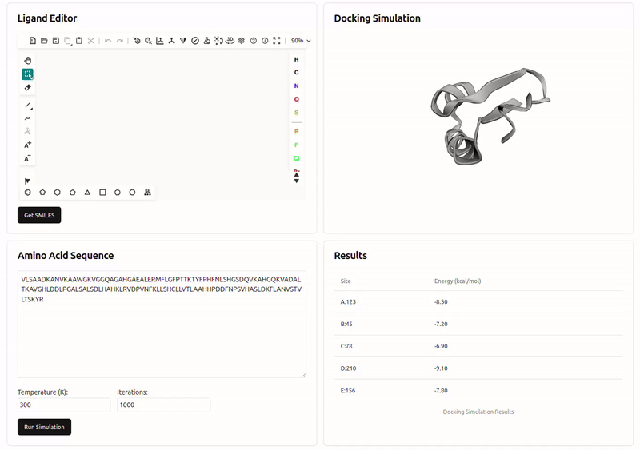

# リバースドッキングダッシュボード

このプロジェクトは、タンパク質とリガンドのリバースドッキングシミュレーションのためのWebベースダッシュボードです。



## 特徴

- リガンドエディタ：Ketcherを使用してリガンド構造の設計と編集
- ドッキングシミュレーションビューア：3Dmol.jsを使用してタンパク質構造とドッキング結果の可視化
- アミノ酸配列エディタ：タンパク質配列の入力と編集
- 結果テーブル：ドッキングシミュレーション結果の表示

## 使用技術

- React
- Vite
- Ketcher
- 3Dmol.js
- Shadcn UI

## 始め方

### 前提条件

- Node.js（バージョン14以降）
- npm（通常Node.jsに付属）

### インストール

1. リポジトリをクローン：
   ```
   git clone https://github.com/knagamatsu/reverse-dock-dashboard.git
   ```

2. プロジェクトディレクトリに移動：
   ```
   cd reverse-dock-dashboard
   ```

3. 依存関係をインストール：
   ```
   npm install
   ```

4. 開発サーバーを起動：
   ```
   npm run dev
   ```

5. ブラウザを開き、`http://localhost:5173` にアクセスしてアプリケーションを表示

## 使用方法

1. リガンドエディタを使用してリガンド構造を設計または変更
2. シーケンスエディタにアミノ酸配列を入力
3. 必要に応じてシミュレーションパラメータを調整
4. 「Run Simulation」をクリックしてドッキングプロセスを開始
5. ドッキングシミュレーションビューアと結果テーブルで結果を確認

